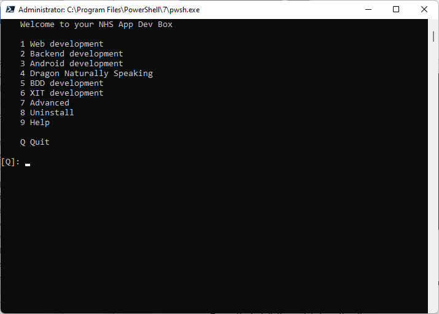

# Introduction

Pipeline1 lets you run a collection of shell or PowerShell scripts in sequence.
Your scripts can be located anywhere on your file system, and organised in a directory structure of your choosing.
Pipeline1 will scan the parent directory and it's child directories, find all of your scripts and then create a registry of where they all are.
It works on Linux, Windows (with or without WSL), and Macos.

The scripts can have dependencies, where some scripts will not run if others have failed.
They can run serially or in parallel, in the current terminal tab or a new tab.
This is useful for running backend servers in their own tab.

For example, if you are working on an app that has Android, IOS and web clients, Python or dotnet
backends with multiple databases and middleware, you will be dealing with several IDEs and development tools.
You can use Pipeline1 to run scripts that setup your development envioronment.
If you have colleagues who use a variety of Windows, Ubuntu and Mac workstations, the complexity setting up workstations will increase.

You can have several apps or projects, and switch between them using the Pipeline1 menu.

Pipeline1 comes with ready made scripts for installing IDEs, package managers involved in building
applications with frontends, backends, docker images, node modules and dotnet packages.

Your scripts can be in an existing repo, or their own repo, or both.

The menus contain the major steps for each of your major development projects.


# Getting started

Clone this repo to wherever you keep your local repos.
Switch to `<repo_dir>/p1`, then run `./p1.sh` or, in Windows,`./p1.ps1`.
This will add the `p1` command to your path and display the main menu.
Restart your terminal.

# Add a project to the menu

To add a collection of scripts to P1, switch to the directory where they are, and then run `p1 install`.
The scripts don't all have to be in the same directory, but they should be underneath one parent directory,

`p1 install` adds the current directory to the file `$HOME/.pipeline1/project_registry.csv`.

# Working directory

A directory named .pipeline1 will be created in your <home> directory. This is where Pipeline1 stores project and step registries.
These are csv files that contain lists of your scripts and where they are located.
It also stores context variables there. These are variables that can be shared between scripts.

# Steps

A step is another name for a script.
Steps are the Shell script or Powershell code files that actually perform the actions.
Each step can have a json configuration file that matches the name of the script file. This specifies the
dependencies and checks that go with the step. It can also contain child steps.
If the step is simple, the code for what it does can be entered as a Shell or PowerShell command directly in the step definition.

## Showing steps in the main menu

You may want to show some steps in the main menu.
These will be steps that perform major development activities in your project, such as building the backend or deploying to a remote server.
They may contain child steps that do the actual work.
To show a step in the main menu, add a property called `menu` to the step's json configuration file, and set it to `main`.

Here is an example:
`web_development.json`

```
{
  "id": "web",
  "menu": "main",
  "sortOrder": 10,
  "title": "Web development",
  "steps": [
    "install_node",
    "activate_node",
    "install_backend",
    "install_vscode",
    "install_text_editor",
    "configure_backend",
    "build_backendworker",
    "build_web",
    "start_docker",
    "docker_login",
    "start_backendworker",
    "start_http_server",
    "open_vscode"
  ]
}
```

Step Ids must be unique across all projects.

If the step has an `exitTo` property, when the step is completed, the OS shell will switch to the specified path.
By default, the path is relative to the project root directory.
If the path begins with a `/` or a `<drive letter>:\`, it is treated as an absolute path.
You can include `..`, `..\\..` and so on in the path to refer to a directory above the project directory.
You can also include environment variable in the path.

## Checks

Each step has an expression called a "check". This is used to work out if the step has been done or not.
The checks look like this:

{
"dependencies": [],
"checks": {
"macos": ["command -v keybase | grep -q keybase"],
"ubuntu": ["true"]
}
}

The checks can be OS specific - macos, ubuntu, win. Unix means macos or ubuntu.
The file name of the step, without the exension, must be unique across all projects.
It must match the file name of it's json configuration file.
For example, if the step file is named install_docker.sh, its configuration file should be install_docker.json.
Step files can be writen in bash shell script (.sh) or in Windows, in Powershell (.ps1). Support will soon be added for other scripting languages.

## Other step properties

**runOnce:** If true, the step will only be run if it has not been run before. This is usefull for installation or build process that take a long time and you don't want to run again unless necessary. Controlled through a file in the .pipeline1 directory in the user's home directory.
**runAlways:** Aways run the step without checking entry and exit checks. Dependencies and child steps are still executed.
**exitTo:** The path to switch to when the step is completed. By default, this is relative to the project root directory.
**newTab:** If true, the step will be run in a new terminal tab.
**steps:** A list of child step Ids to run as part of this step.
**isActive:** If false, the step will be ignored.

## Scope

The scope of a step can be public or private. By default, steps are public. Private steps are steps that do nothing useful by themseleves,
but a libraries or sub-modules for other steps. Private steps are not shown when you run `p1 list`.

## Step names

The name of the step config file must match the name of the script file.
For example, if the step script is `install_node.sh`, the step config file must be `install_node.json`.
Step names must be unique across all projects.

# Uniquenes of Ids

Step Ids must be unique across all projects, since a step defined in one project can be used in all projects.
Project Ids must be unique.

# CLI commands

- `p1`: Shows the main menu. This contains a list of all projects and menu steps.
- `p1 <step Id>`: Runs the specified step.
- `p1 install`: Adds a new project to the menu.
- `p1 list`: Lists all scripts in all projects.
- `p1 scan`: Updates the step registry with scripts from all projects. Run this command after adding new scripts.
- `p1 help`: Shows the help menu.
